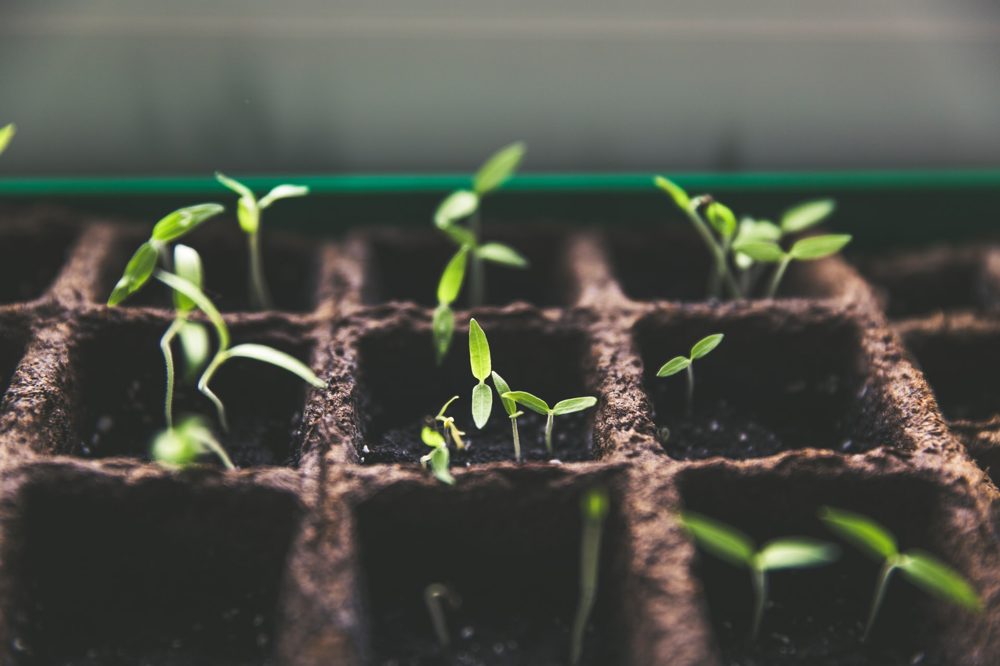

# Project Internet Of Ag (IoA)

Our project aims to use data from publicly available IoT devices, such as air quality, humidity and temperature sensors from different regions in QLD; with a particular focus on Moreton Bay, since they've got established IoT infrastructure. This project combines these near-real time data sources with open data about crop yield sales, weather predictions, water availability and bush fire probability. These data driven insights enable farmers to make informed decisions about when to harvest their crops, and what kind of crops should be grown to maximise profits, and reduce product waste.

There three parts to the project:
- The data and the sensors
- Backend to process all the data
- An app and web interface for the user to use to recieve predictions and monitor their farms.

## Sensors and Data

The Moreton Bay regional Council has provided a wide range of IoT devices that are fitted with sensors ranging from light sensors, to humidity and temperature sensors. Furthermore, the Queensland Government has a collection of IoT devices that provide air quality data all over the state.

Adding to the near realtime data of IoT devices, government organizations like the Department of Agriculture and Fisheries QLD, provide insights into agribusiness by providing data sets that look at consumer trends and money spent on produce in certain regions. There are also tool kits like Spark from CSIRO and data APIs from BOM which can help with predicting and monitoring bushfire and other weather events like cyclones and heat waves. 

## Backend
The backend of the app runs on a cloud service like Microsoft's Azure. It will analyse data from the IoT devices using their APIs and combine it with information provided by the user, and the open data sets. Using all this information, the system will make recommendations to the user. 

## App and web interface
The mobile app acts as the front end for all the IoT and weather related data. This way the user can check the status of their farms while on the field.

The web interface provides the user with insights to their agribusiness, while using popularity data from open data sets to suggest what to produce to be more sustainable and profitable. 

## Sketches of App

  
  

## Sketch of Web Interface

